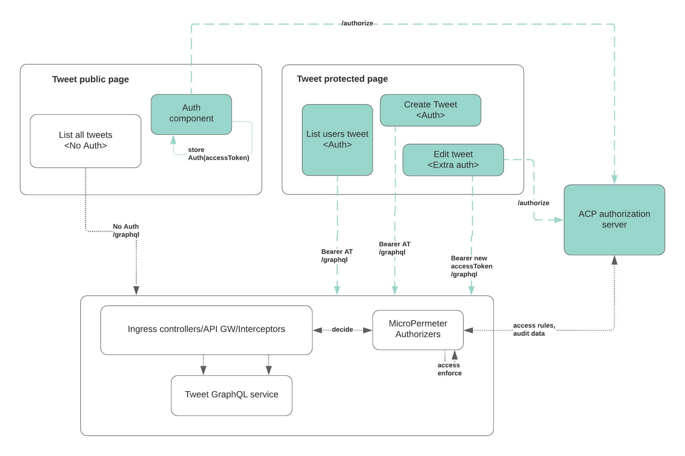

# Build a GraphQL client application to consume protected GraphQL API resources

This article is part 3 of our GraphQL application protection series. In this article, we will build a GraphQL client
that is capable of invoking GraphQL API calls, obtain authorized accessTokens from a Cloudentity authorization server
and send the authorization token to underlying GraphQL services.

* Part 1: Externalized authorization for GraphQL using the Cloudentity authorization platform
* Part 2: Build a GraphQL server with Node.js and protect with the Cloudentity authorization platform
* Part 3. Build a GraphQL client react application to consume GraphQL server resources protected with the Cloudentity authorization platform



## Build a single page React app with Nodejs

In the previous article, we built the GraphQL server with Node.js, `express`, `graphql` and `loki` as a built-in database for this
demonstration. The goal was to build a GraphQL server and have its endpoint protected.

We then deployed this application to a native Kubernetes cluster using `kind` and enforced centralized
and decoupled authorization without changing any business logic or code. See the previous article for all the details.

[Source code for the React application](https://github.com/cloudentity/ce-samples-graphql-demo/tree/master/tweet-ui-graphql-react)

---
**SKIP/JUMP LEVEL**

In case you are not interested in building the application from scratch, you can skip some of the steps below and instead checkout/clone the [attached github repo](https://github.com/cloudentity/ce-samples-graphql-demo) and `cd tweet-ui-graphql-react` and then go
to [Run the application](#run-the-application)

---

### Pre-requsisites

We will be using `react` for the application development.

```bash
- [npm](https://docs.npmjs.com/getting-started) - Recommended v8.3.0 +
```

### Initialize React app

```bash
npx create-react-app tweet-ui-graphql-react
```

And install required packages

* mui - [Material ui for icons, styles, fonts](https://mui.com/getting-started/installation/)
* react - core react functions
* cloudentity/auth - Cloudentity JS sdk to fetch and store OAuth accessTokens

```bash
npm install --save react-router-dom
npm install --save @apollo/client graphql@15.3.0
npm install --save @mui/material @emotion/react @emotion/styled @mui/icons-material
npm install --save @cloudentity/auth
```

### Define React components

#### Routing

For this react application, let's define the routing for various resources.
As per this sample application, we will have
* page that does not require authorization (/ page)
* element that allows user to authorize (auth function within / page)
* page that requires authorization (/usertweet)
  ** if there is no user authorization, the user will be redirected to / page

So in our application routing, let's define the router and the auth redirects. We will use
the Cloudentity Auth sdk to handle OAuth authorization (code => token exchange), redirects and
setting of the `accessToken`. If an `accessToken` is not available in the local storage, user
will be redirected to the page where they can see the `authorize` button and contents that
do not require authorized tokens.

In `index.js`, located in the `src` directory of the app, we'll add:

```js
function App() {

  //const navigate = useNavigate();
  const cloudentity = new CloudentityAuth(authConfig);
  const [authenticated] = useAuth(cloudentity);
  const accessTokenRaw = localStorage.getItem(authConfig.accessTokenName);
  const auth = authenticated && accessTokenRaw;

  return (
    <Router>
      <div>
        <Routes>
          <Route path="/usertweet"  element={!auth ?<HomePageContent auth={auth} /> : <Navigate to='/usertweet' /> }></Route>
          </Route>
          <Route path="/"  element={!auth ? <HomePageContent auth={auth} /> : <Navigate to='/usertweet' /> }>
          </Route>
        </Routes>
      </div>
    </Router>
  );

}

```

So as you can see the public page is at `HomePageContent` that is served by `homepage.js`. Let's dive into that
snippet for some explanation.

#### Homepage

`homepage.js` contains mainly two main elements of interest other than navigation and style elements
 * `authorize` button   => Calls to Cloudentity authorization platform to authorize the user
 * `Latest tweets` element => Unprotected GraphQL API call

#### Configure GraphQL API client

We need to configure the GraphQL API client to send in an authorization token (if available) retrieved from the browser's local storage.
If not, it will make GrpahQL API calls without this authorization token . [More details and explanation
about usage of apollo client can be found here](https://www.apollographql.com/docs/react/why-apollo/)

```js
import {
    ApolloClient,
    InMemoryCache,
    ApolloProvider,
    createHttpLink,
    from
  } from "@apollo/client";
  import { setContext } from '@apollo/client/link/context';
  import { onError } from "@apollo/client/link/error";

const httpLink = createHttpLink(
  {
    uri: 'graphql',
    credentials: 'same-origin'
  }
);

const authLink = setContext( (_, {headers}) => {
  // get the authentication token from local storage if it exists

 const accessTokenRaw = localStorage.getItem(authConfig.accessTokenName);
  //return the headers to the context so httpLink can read them

  return {
    headers: {
      ...headers,
      authorization: accessTokenRaw ? `Bearer ${accessTokenRaw}`: "",
    }
  }
});

//https://www.apollographql.com/docs/react/api/link/apollo-link-error/
const errorLink = onError(({ graphQLErrors, networkError }) => {
  if (graphQLErrors)
    graphQLErrors.forEach(({ message, locations, path }) =>
      console.log(
        `[GraphQL error]: Message: ${message}, Location: ${locations}, Path: ${path}`,
      ),
    );

  if (networkError) console.log(`[Network error]: ${networkError}`);
});


const client = new ApolloClient (
  {
    link: from([authLink, errorLink, httpLink]),
    cache: new InMemoryCache()
  }
);

```

### Invoking GraphQL APIs

For invoking GraphQL APIs we will utilize the Apollo client configured above

```js

import {
  useQuery,
  gql
} from "@apollo/client";


const FETCH_LATEST_TWEETS = gql `
query {
    getLatestTweets {
        id,
        content,
        author
    }
  }
`;

export function GetLatestTweets() {
  const {loading, error, data} = useQuery(FETCH_LATEST_TWEETS);

  const  [latestTweetFetchStatus, setFetchLatestTweetsStatus] = useState(false);

  if (loading) return <p>Loading..</p>;
  if (error && isError403(error)) return (
    <div>
        <h2> Latest Tweets</h2>
        <p> Our systems have detected that this request is NOT authorized to see the tweets... </p>
        <p> Reason for unauthorized: </p>

    </div>
);
  if (error) return (
      <div>
          <h2> Latest Tweets</h2>
          <p> System connection issues ... </p>

      </div>
  );

  if(!latestTweetFetchStatus && data != null && data.getLatestTweets != null) {
    setFetchLatestTweetsStatus(true);
  }

  if(latestTweetFetchStatus) {
    return (
      <div>
        <h2> Latest Tweets</h2>

        {
          Object.keys(data.getLatestTweets).map((k,i) => (
              <div>
                  <div> {data.getLatestTweets[i].owner} @ {data.getLatestTweets[i].id}</div>
                  <div> tweeted - </div>
                <div>Hi {i} {k} {data.getLatestTweets[i].content} </div>

            </div>
          ))
        }


      </div>
    );
  }
  return <TweetsNotAvailable />;

}
```

So now we have a homepage that prompts the user to authorize, resulting in an authorization token to call more
resource server APIs, as well as making a call to a publicly exposed GraphQL API resource endpoint.

#### Getting an authorization token from Cloudentity

We will use the [Cloudentity OAuth JS SDK](https://github.com/cloudentity/cloudentity-auth-js) to perform an OAuth handshake with Cloudentity authorization platform and fetch an authorizationToken.

`authButton.js`

```js
import CloudentityAuth from '@cloudentity/auth';
import authConfig from './authConfig.js';

export const AuthButton = ({auth}) => {

  const classes = useStyles();

  const handleAuth = () => {
    const scopes = 'all';
    console.log(authConfig);
    const cloudentity = new CloudentityAuth({...authConfig, ...scopes});
    cloudentity.authorize();
  };

  const buttonOnClick = () => {
    handleAuth();
  }

  return (
    <div className={classes.root} >
      <Stack className={classes.mainSection} direction="column" justifyContent="center" alignItems="center">
        <p>If you want to see more than this, we need to identity and authorize you further.
        <h3>Let's get you in there!</h3>
        </p>
        <Tooltip title="This will intiate OAuth authorization request with Cloudentity ACP" placement="top">
          <Button className="AuthenticateButton" variant="contained" onClick={() => buttonOnClick()}>Authorize</Button>
        </Tooltip>
      </Stack>
    </div>
  );

}
```

`authConfig.ts`

This file contains the configuration required to handshake with Cloudentity authorization platform to obtain an accessToken. For getting an accessToken, [follow this Cloudentity article to register a client
application in Cloudentity authorization platform](https://docs.authorization.cloudentity.com/guides/developer/protect/application/) and populate the details in this configuration based on that.

```js
const authConfig = {
    domain: 'rtest.authz.cloudentity.io', // e.g. 'example.demo.cloudentity.com.' Recommended; always generates URLs with 'https' protocol.
     // baseUrl: optional alternative to 'domain.' Protocol required, e.g. 'https://example.demo.cloudentity.com.'
     // In situations where protocol may dynamically resolve to 'http' rather than 'https' (for example in dev mode), use 'baseUrl' rather than 'domain'.
     tenantId: 'rtest',
     authorizationServerId: 'ce-dev-playground-integrations',
     clientId: 'c7e6u0eer3qh0m4pggig',
     redirectUri: 'http://localhost:3000/',
     silentAuthRedirectUri: 'window.location.href' + '/silent', // optional setting to redirect to a different endpoint following successful silent auth flow
     userInfoUri: 'https://rtest.authz.cloudentity.io/rtest/ce-dev-playground-integrations/userinfo', // optional, for fetching user info via API
     scopes: ['profile', 'email', 'openid'], // 'revoke_tokens' scope must be present for 'logout' action to revoke token! Without it, token will only be deleted from browser's local storage.
     letClientSetAccessToken: true,
     accessTokenName: 'ins_demo_access_token', // optional; defaults to '{tenantId}_{authorizationServerId}_access_token'
     idTokenName: 'ins_demo_id_token', // optional; defaults to '{tenantId}_{authorizationServerId}_id_token'

 };

export default authConfig;

```

* Proxy to eliminate CORS error

By default you will run into CORS error as the GraphQL APIs are served on a different host/port. To eliminate this we will use the React dev proxy to proxy all requests to GraphQL API server.

`package.json`

```json
{
  "proxy": "http://localhost:5001",
}
```

### Run the application

```
npm start
```

```js
http://localhost:3001
```


### Conclusion

This wraps up the tutorial for a sample GraphQL client server application protected using the Cloudentity Authorization platform.
In this series, you would have accomplished following things:
 * Develop a simple GraphQL service
 * Protect the GraphQL service API resources with Cloudentity ACP
 * Develop a simple GraphQL client application
 * Fetch authorization tokens from Cloudentity ACP and pass from the client app to the protected server resource
 * Dynamically change the protected server resource policy in ACP to control client app GraphQL API data access.
